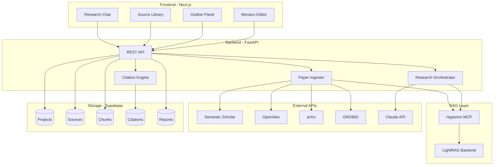

# Academic Research Tool - Architecture

## System Overview

The Academic Research Tool is an AI-powered assistant for academic paper writing. It provides a tight loop between:

1. **Outlining** - Structure your research
2. **Research** - Find and ingest papers
3. **Synthesis** - Query papers via RAG
4. **Writing** - Collaborative AI-assisted writing
5. **Citations** - Automatic citation management

## High-Level Architecture



## Component Details

### Frontend (Next.js)

| Component | Purpose |
|-----------|---------|
| Monaco Editor | Rich text writing interface |
| Outline Panel | Structure research sections |
| Source Library | Manage ingested papers |
| Research Chat | Query papers, get cited answers |

### Backend (FastAPI)

| Component | Purpose |
|-----------|---------|
| REST API | HTTP endpoints for all operations |
| Research Orchestrator | Coordinate search, ingest, query |
| Citation Engine | Track provenance, format citations |
| Paper Ingester | Download, parse, chunk, store papers |

### RAG Layer (Hyperion/LightRAG)

| Component | Purpose |
|-----------|---------|
| Hyperion MCP | MCP interface to LightRAG |
| LightRAG | Graph-based RAG backend |

**Note**: Hyperion is a **separate MCP server** from AK. We call it directly.

## Data Flow

### 1. Paper Ingestion Flow

```
User searches → Semantic Scholar API → Paper metadata
                                              ↓
                              Download PDF from arXiv/Unpaywall
                                              ↓
                                    GROBID parses PDF
                                              ↓
                              Extract sections, references
                                              ↓
                                    Chunk by section
                                              ↓
                              Store chunks in LightRAG
                                              ↓
                              Store metadata in Supabase
```

### 2. Query Flow

```
User asks question → Backend
                        ↓
              Enhance query (Claude)
                        ↓
              Query LightRAG via Hyperion
                        ↓
              Retrieve relevant chunks
                        ↓
              Synthesize answer (Claude)
                        ↓
              Return answer with citations
```

### 3. Citation Flow

```
Chunk retrieved → Create citation record
                        ↓
              Link to synthesis record
                        ↓
              User inserts in document
                        ↓
              Track document position
                        ↓
              Generate bibliography
```

## Data Model

### Core Entities

```sql
-- Project: Container for research
CREATE TABLE project (
    id UUID PRIMARY KEY,
    title TEXT NOT NULL,
    abstract TEXT,
    owner_id UUID,
    created_at TIMESTAMPTZ,
    updated_at TIMESTAMPTZ
);

-- Outline: Research structure
CREATE TABLE outline (
    id UUID PRIMARY KEY,
    project_id UUID REFERENCES project(id),
    sections JSONB,  -- Nested section structure
    research_questions JSONB
);

-- Source: Academic paper
CREATE TABLE source (
    id UUID PRIMARY KEY,
    project_id UUID REFERENCES project(id),
    doi TEXT UNIQUE,
    title TEXT NOT NULL,
    authors JSONB,
    abstract TEXT,
    publication_date DATE,
    venue TEXT,
    pdf_url TEXT,
    metadata JSONB
);

-- Chunk: Indexed text chunk
CREATE TABLE chunk (
    id UUID PRIMARY KEY,
    source_id UUID REFERENCES source(id),
    content TEXT NOT NULL,
    section_type TEXT,  -- abstract, methods, results, etc.
    page_number INT,
    lightrag_id TEXT,  -- Reference to LightRAG
    metadata JSONB
);

-- Synthesis: Query response
CREATE TABLE synthesis (
    id UUID PRIMARY KEY,
    project_id UUID REFERENCES project(id),
    query TEXT NOT NULL,
    response TEXT NOT NULL,
    chunk_ids UUID[],  -- Sources used
    created_at TIMESTAMPTZ
);

-- Citation: In-document reference
CREATE TABLE citation (
    id UUID PRIMARY KEY,
    synthesis_id UUID REFERENCES synthesis(id),
    chunk_id UUID REFERENCES chunk(id),
    in_text_format TEXT,  -- e.g., "(Smith, 2024)"
    full_reference TEXT,
    position_in_doc JSONB,
    created_at TIMESTAMPTZ
);

-- Report: Written document
CREATE TABLE report (
    id UUID PRIMARY KEY,
    project_id UUID REFERENCES project(id),
    content TEXT,
    version INT,
    citations JSONB,
    created_at TIMESTAMPTZ
);
```

## API Endpoints

### Projects

| Method | Endpoint | Description |
|--------|----------|-------------|
| POST | `/api/projects` | Create project |
| GET | `/api/projects` | List projects |
| GET | `/api/projects/{id}` | Get project |
| PUT | `/api/projects/{id}` | Update project |
| DELETE | `/api/projects/{id}` | Delete project |

### Sources (Papers)

| Method | Endpoint | Description |
|--------|----------|-------------|
| POST | `/api/projects/{id}/sources/search` | Search papers |
| POST | `/api/projects/{id}/sources/ingest` | Ingest paper |
| GET | `/api/projects/{id}/sources` | List sources |
| GET | `/api/sources/{id}` | Get source |
| DELETE | `/api/sources/{id}` | Remove source |

### Research (RAG)

| Method | Endpoint | Description |
|--------|----------|-------------|
| POST | `/api/projects/{id}/research/query` | Query papers |
| POST | `/api/projects/{id}/research/compare` | Compare findings |
| POST | `/api/projects/{id}/research/summarize` | Summarize paper |
| GET | `/api/projects/{id}/syntheses` | List syntheses |

### Writing

| Method | Endpoint | Description |
|--------|----------|-------------|
| POST | `/api/projects/{id}/report` | Create report |
| PUT | `/api/reports/{id}` | Update report |
| POST | `/api/reports/{id}/assist` | AI writing assist |
| POST | `/api/reports/{id}/cite` | Insert citation |
| GET | `/api/reports/{id}/bibliography` | Generate bibliography |

## External API Integration

### Semantic Scholar

```python
BASE_URL = "https://api.semanticscholar.org/graph/v1"

# Search papers
GET /paper/search?query={query}&fields=paperId,title,authors,abstract,year,citationCount

# Get paper details
GET /paper/{paper_id}?fields=paperId,title,authors,abstract,year,venue,openAccessPdf
```

### OpenAlex

```python
BASE_URL = "https://api.openalex.org"

# Search works
GET /works?search={query}&filter=type:article

# Get work details
GET /works/{openalex_id}
```

### arXiv

```python
BASE_URL = "http://export.arxiv.org/api"

# Search papers
GET /query?search_query={query}&max_results=20

# PDF download
GET https://arxiv.org/pdf/{arxiv_id}.pdf
```

### GROBID

```python
BASE_URL = "http://grobid.example.com/api"  # Self-hosted or cloud

# Parse PDF
POST /processFulltextDocument
Content-Type: multipart/form-data
Body: input (PDF file)
```

## Security Considerations

1. **API Keys**: All external API keys stored in environment variables
2. **Authentication**: Supabase Auth for user authentication
3. **Authorization**: Row-level security on project access
4. **Rate Limiting**: Implement rate limits on external API calls

## Scalability Considerations

1. **PDF Processing**: Queue-based processing for large PDFs
2. **RAG Queries**: Cache common queries
3. **Chunking**: Async chunking for large documents
4. **Storage**: Supabase for structured data, LightRAG for embeddings

## Future Enhancements

- Multi-user collaboration
- Real-time sync
- Plugin system for additional databases
- Export to LaTeX, Word, PDF
- Reference manager import (Zotero, Mendeley)

